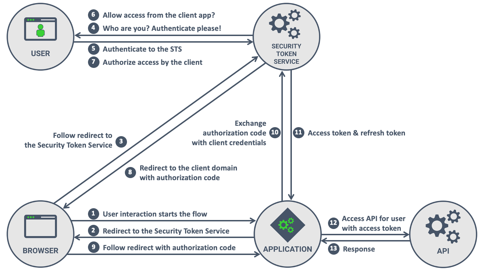
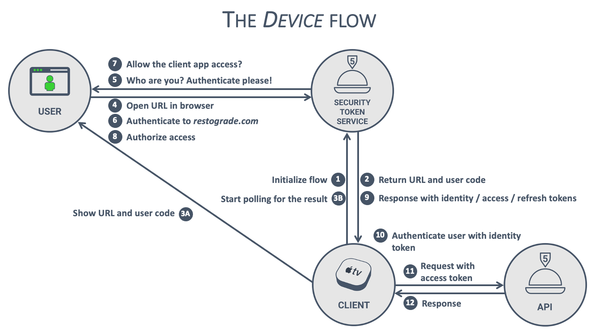

# OAuth2: 클라이언트 서버 구현하기 

스프링 시큐리티에서 제공하는 샘플로 OAuth 2 Client server 를 직접 구현한다. 구현 순서대로 컴포넌트의 간단한 설명을 기술하며 구체적인  

구현 구조 및 컴포넌트는 애플리케이션 예제 파일과 시나리오 내용을 참고한다.

```
시큐리티에서 제공하는 샘플 모델  
https://github.com/spring-projects/spring-authorization-server/tree/main/samples/demo-client 

아파치 라이이선스란 ?
https://namu.wiki/w/%EC%95%84%ED%8C%8C%EC%B9%98%20%EB%9D%BC%EC%9D%B4%EC%84%A0%EC%8A%A4 참고
```
## cofnig

클라이언트 애플리케이션의 전반적인 자바 설정 및 yml 설정
```
* SecurityConfig

기본적인 시큐리티 설정을 만든다. 클라이언트 서버는 권한 부여 서버를 oauth2Login 으로 사용하며 허용할 수 있는 요청과
인증이 필요한 요청, 로그아웃 핸들러로 구성된다.
```
```
* WebClientConfig

웹 클라이언트는 클라이언트 서버에서 리소스 서버에 API 를 요청할 때 사용된다. 스프링 리액티브가 제공하는 Http Request 요청
라이브러리로써 ServletOAuth2AuthorizedClientExchangeFilterFunction 및 provider 설정을 추가한다.

이 설정값은 OAuth2AuthorizedClient 클래스로 액세스 토큰값을 가져와서 디바이스 그랜트 유형 요청에 필요한 토큰 attributes 를
modifies 할 때 사용된다. - API 계층 참고 
```
```
* application.yml

클라이언트 유형 및 애플리케이션 전반적인 설정 클라이언트 유형은 권한 부여 서버에 액세스 토큰을 요청할 때, 리소스 서버 API 를
호출하기 위한 토큰 값을 가져올 때 사용된다
```
## authoriztaion

이 패키지의 authoriztaion 설정은 디바이스 그랜트 유형시 사용된다.
```
DeviceCodeOAuth2AuthorizedClientProvider 는 클라이언트 애플리케이션에서 WebClient 로 리소스 API 를 호출할 때 적용되는데 
승인 코드 그랜트 유형이나 패스워드 그랜트 유형이 아닌 디바이스 코드 그랜트 유형일때 적용된다.

액세스 토큰이 만료된 경우 리프레쉬 토큰을 사용해서 새 토큰을 받아오고 토큰이 모두 만료되었다면 새로운 토큰 값을 요청하는
공급자를 구현한다.
```
## web
```
리소스 서버 및 인증/인가를 호출하는 API 가 있다.
```
## 클라이언트 서버가 리소스에 접근하는 시나리오

OAuth 2 인증 방식을 스프링 시큐리티로 구현한 시나리오를 정리하고 간단하게 flow 흐름을 그림으로 소개한다.

참고로 이 내용은 권한 부여 서버 챕터의 내용과 똑같은 내용이다.

### 승인 코드 그랜트 유형

  

그림 출처: https://pragmaticwebsecurity.com/articles/oauthoidc/from-implicit-to-pkce.html

```
권한이 없는 브라우저(사용자) 가 클라이언트 애플리케이션에 접근하면 클라이언트 애플리케이션은 브라우저를 권한 부여 서버의
로그인 페이지로 리다이렉트 시킨다.

클라이언트 애플리케이션은 브라우저(사용자) 를 인증 페이지로 리다이렉트 시킬 때 클라이언트 유형 정보
(client_id, redirect_uri, scope, state) 와 승인 코드를 요청하는 쿼리를 포함해서 리다이렉트 시킨다.
 (사용자 브라우저는 권한 부여 서버 인증 요청시 이 요청을 같이 보낸다.)

사용자는 로그인 페이지에서 formLogin 또는 OAuth2Login 방식으로 권한 부여 서버에 인증 요청을 한다. 

이때 토큰이 만들어지는 단계는 두 단계로 나뉘는데 처음 로그인에 성공하면 인증 토큰(Authneticaiton) 이 만들어지고
권한 부여 서버는 세션 값을 저장한 후 클라이언트에게 응답한다.

그리고 권한 부여 서버는 로그인한 사용자 계정의 권한 범위에 클라이언트가 접근하게 할 수 있는지 사용자에게 동의를
묻는 화면을 보여주는데 (개별 설정을 한 경우)

클라이언트에게 scope 를 제공하는 것을 동의하면 권한부여 서버는 브라우저에 클라이언트가 액세스 토큰을 요청할 수 있는
승인 코드를 전달한다. 

권한 부여 서버에 사용자가 인증 하는 과정에서 승인 코드 요청과 함께 클라이언트 유형 정보를 포함한다. 인증에 성공하면
승인 코드는 클라이언트 애플리케이션에 전달된다.

클라이언트는 승인 코드를 사용해서 액세스 토큰을 요청할 수 있는데 이 과정을 Authorization 이라고 한다.
권한 부여 서버는 액세스 토큰 (Authentication) 값을 세션에 저장하고
(액세스 토큰은 메모리 또는 JPA 를 이용해서 데이터베이스에 저정할 수 있다.) 

클라이언트 애플리케이션(브라우저) 에 액세스 토큰을 넘겨준다. 클라이언트 애플리케이션은 액세스 토큰을 사용해서 사용자의
리소스에 접근할 수 있게된다.

이때 클라이언트 애플리케이션은 단순히 액세스 토큰을 세션 값으로 넘겨주는 것 만으로는 사용자 리소스에 접근할 수는 없다.
클라이언트는 사용자 리소스에  접근할 수 있는 리소스 API 를 가지고 있다. 

리소스 API 를 호출하면서 클라이언트는 OAuth2AuthorizedClient 값을 포함한 요청을 하게 되는데 이 클래스는 클라이언트
애플리케이션이 액세스 토큰에 접근할 수 있게 해준다.

이 클라이언트 인스턴스는 ServletOAuth2AuthorizedClientExchangeFilterFunction 필터를 통해서 관리할 수 있다. 
```
## 디바이스 코드 그랜트 유형

  

그림 출처: https://pragmaticwebsecurity.com/articles/oauthoidc/device-flow.html

```
디바이스 그랜트 유형은 승인 코드 그랜트 유형과는 다른 부분이 있다. 승인 코드 그랜트 유형은 브라우저가 시작점이 된다.
사용자가 브라우저에서 인증에 성공하면 권한 부여 서버의 승인 코드가 클라이언트 애플리케이션에 전달되는 구조라면 

디바이스(애플 티비같은 것을 의미함) 유형은 디바이스(클라이언트) 에서 권한 부여 서버에 액세스 토큰을 요청하면서 흐름이 시작된다. 

디바이스 클라이언트는 액세스 토큰을 요청하면서 인가 논리에 필요한 사용자 코드와 사용자 인가 페이지 url, 승인 코드 값을 직접 받는다.
그리고 디바이스 클라이언트는 권한 부여 서버에 액세스 토큰 요청을 반복적으로 시도하는데

사용자 코드와 사용자 인가 페이지 url 로 사용자가 별도의 브라우저에서 인가에 성공하면 액세스 토큰을 얻을 수 있다.

디바이스 클라이언트가 API 를 호출하는 과정은 승인 코드 그랜트 유형과 마찬가지로 OAuth2AuthorizedClient 값을 포함한
요청을 하게된다.

이때 승인 코드 그랜트 유형과는 다르게 ServletOAuth2AuthorizedClientExchangeFilterFunction 를 거쳐서 provider 를
통해 필요한 추가적인 작업이 발생하게 된다 (스프링 시큐리티를 사용하는 경우)
```
# 스프링 시큐리티 클라이언트 래퍼런스

래퍼런스에 있는 내용을 번역해서 정리 필요시 래퍼런스를 직접 참고한다.

## ClientRegistration 세부 구성

```
https://docs.spring.io/spring-security/reference/servlet/oauth2/client/core.html 참고

A ClientRegistration object holds information, such as client id, client secret, authorization grant type, redirect URI, scope(s),
authorization URI, token URI, and other details.

1. 클라이언트(인증 서버) 전체 정보
public final class ClientRegistration {
private String registrationId; // 클라이언트 저장소에서 클라이언트를 식별하는 유니크 아이디
private String clientId; // 클라이언트(인증 서버) 아이디
private String clientSecret; // 클라이언트(인증 서버) 시크릿	
private ClientAuthenticationMethod clientAuthenticationMethod; // 인증 메서드	
private AuthorizationGrantType authorizationGrantType; // 승인 그랜트 유형	
private String redirectUri;	// 액세스 코드를 얻을 수 있는 승인 코드를 받는 리다이렉트 uri
private Set<String> scopes;	// 사용자 정보 범위
private ProviderDetails providerDetails; // 공급자 정보(인증 서버의 상세 정보)
private String clientName;	// 클라이언트 이름

2. 공급자(클라이언트 - 인증 서버) 세부 정보
public class ProviderDetails {
private String authorizationUri; // 인증 화면 (로그인 화면)	
private String tokenUri;	// 인증 서버의 토큰 주소
private UserInfoEndpoint userInfoEndpoint; // 사용자 상세 정보
		
private String jwkSetUri;	
// JWK 를 얻을 수 있는 주소, JWK 는 암호화 키로써 JWS(서명된 JWT 토큰) 를 확인하고 유저 인포를 확인할 수 있다. 
The URI used to retrieve the JSON Web Key (JWK) Set from the Authorization Server, which contains the cryptographic key(s) used 
to verify the JSON Web Signature (JWS) of the ID Token and (optionally) the UserInfo Response.
		
private String issuerUri;	
// Connect 1.0 provider or the OAuth 2.0 Authorization Server 의 주소 (토큰을 발행하는 인증 서버 주소) 
   
private Map<String, Object> configurationMetadata;  
//The OpenID Provider Configuration Information. This information is available 
only if the Spring Boot 2.x property spring.security.oauth2.client.provider.[providerId].issuerUri is configured.

3. 클라이언트(인증 서버) 에서 유저 정보를 얻을 수 있는 엔드포인트
public class UserInfoEndpoint {
private String uri;	// Claims(사용자 속성?) 에 접근할 수 있는 uri 
private AuthenticationMethod authenticationMethod;  // 액세스 토큰으로 유저 정보에 접근할 때 사용하는 메서드, 헤더나 쿼리 값을 쓴다.
private String userNameAttributeName;	// 유저 정보를 보여줄 때 이 값을 참조해서 이름을 보여준다		}}} 

결론: 클라이언트 정보(인증 서버 정보) 를 커스텀 할 수 있다.
```
## ClientRegistration 이 제공하는 편리한 메서드들 

## ClientRegistrationRepository
```
클라이언트 등록 정보(인증 서버 정보) 는 인증 서버로부터 얻을 수 있다. 클라이언트 등록 저장소에는 인증 서버로 부터 얻은 
기본적인 인증 서버의 정보가 저장된다. 

앞서 설명했지만 클라이언트는 고유한 식별자를 가진다. 스프링 부트 자동 구성을 사용하면 고유한 식별자로 클라이언트를 저장소에 등록한다.
클라이언트 저장소는 기본적으로 메모리저장소를 사용한다.

ClientRegistration 을 다른 클래스에서 사용하려면 클라이언트 저장소를 빈으로 만들고
스프링 컨테이너에 올린 다음 DI 를 이용해서 사용하면 된다.

@Autowired // 예제 설명을 위한 필드 주입 
private ClientRegistrationRepository clientRegistrationRepository;
    
@GetMapping("/")
public String index(){
ClientRegistration google = this.clientRegistrationRepository.findByRegistrationId("google");

String issuerUri = google.getProviderDetails().getIssuerUri();
return "google";}
```

## OAuth2AuthorizedClientRepository and OAuth2AuthorizedClientService

인증된 클라이언트(사용자) 를 저장하고 싶으면 저장소와 서비스를 구현해서 저장할 수 있음.

참고로 스프링 부트는 기본 저장소를 제공해준다.
```
Spring Boot 2.x auto-configuration registers an OAuth2AuthorizedClientRepository or an OAuth2AuthorizedClientService
@Bean in the ApplicationContext.

However, the application can override and register a custom OAuth2AuthorizedClientRepository or OAuth2AuthorizedClientService
@Bean.
```

### OAuth2AuthorizedClient (인증된 클라이언트)
```
OAuth2AuthorizedClient serves the purpose of associating an OAuth2AccessToken (and optional OAuth2RefreshToken) 
to a ClientRegistration (client) and resource owner, who is the Principal end-user that granted the authorization.
```
### OAuth2AuthorizedClientService
```
서비스를 구현해서 OAuth2AuthorizedClient 를 관리할 수도 있다. 
// OAuth2LoginConfig, OAuth2AuthorizedClientRepository and OAuth2AuthorizedClientService 참고 
```

## OAuth2AuthorizedClientManager and OAuth2AuthorizedClientProvider
```
OAuth2AuthorizedClientManager 인증된 클라이언트(사용자) 들을 전반적으로 관리하는 역할을 한다.
The OAuth2AuthorizedClientManager is responsible for the overall management of OAuth2AuthorizedClient(s).
```

### OAuth2AuthorizedClientManager 의 역할
```
1. OAuth2AuthorizedClientProvider 를 사용해서 OAuth 2 클라이언트(사용자)를 인증하거나 재인증하게 한다 
2. 인증된 클라이언트를 영속화 하는 일을 인증 서비스 계층과 리포지토리 계층에 위임한다.

3. OAuth2AuthorizationSuccessHandler 에게 성공된 인증을 처리하거나 재 인증하게 할 수 있다. (Delegating) 
4. OAuth2AuthorizationFailureHandler 에게 사용해서 실패한 인증을 처리하거나 재 인증하게 할 수 있다 (Delegating) 

OAuth2AuthorizedClientProvider 는 인증(or 재인증) 전략을 구현한다. 인증할 때 어떤 것을 인증할지 빌드함.
```
### OAuth2AuthorizedClientManager 와 OAuth2AuthorizedClientProvider 구현 하기

OAuth2LoginConfig 참고

```
* 전체적인 흐름 정리 (클라이언트가 인증에 성공하고 액세스 토큰을 얻는 경우)

사용자가 리소스 서버에 접근하기 위해 인증을 시도하면 클라이언트(웹 애플리케이션) 는 사용자를 인증 서버에서 인증(로그인)
하게 리다이렉트 한다. 

리다이렉트된 사용자가 인증 서버에 인증하게되면 클라이언트(웹 애플리케이션) 는 승인 코드를 가지게되고 승인 코드를 
이용해서 액세스 토큰을 인증 서버에 요청한다.

승인코드를 사용해서 액세스토큰을 얻는 과정은 기본적인 스프링 시큐리티 인증 메커니즘과 비슷하다. 

OAuth2LoginAuthenticationFilter (인증 필터) 는 요청을 가로채고 클라이언트가 OAuth 2 액세스 토큰을 얻을 수 있게 
인증 매니저에게 전달한다.   

인증 매니저는 인증 공급자를 사용해서 클라이언트를 인증하거나 재인증 할수 있다. (인증 공급자는 인증,재인증 전략을 빌드함)
클라이언트가 인증에 성공하면 요청한 클라이언트의 Principal 정보를 나타내는 액세스 토큰이 만들어지고

인증에 성공한 클라이언트는 앞서 설명한 인증 클라이언트 리포지토리에 저장된다. 
Upon a successful authentication, an OAuth2AuthenticationToken is created (representing the End-User Principal)
and associated to the Authorized Client using the OAuth2AuthorizedClientRepository.

인증에 성공한 클라이언트를 리포지토리에 저장하는 역할은 인증 매니저가 OAuth2AuthorizationSuccessHandler 에게 위임한다.
성공 핸들러의 기본 값은 인증에 성공한 OAuth2AuthorizedClient 를 OAuth2AuthorizedClientRepository 에 저장하는 역할을 한다.

마지막으로 액세스 토큰은 궁극적으로 SecurityContextRepository 에 저장된다. 
Finally, the OAuth2AuthenticationToken is returned and 
ultimately stored in the SecurityContextRepository to complete the authentication processing.

(참고로 토큰은 Principal 필드 값을, 인증된 클라이언트는 principalName 을  가지게 된다)

OAuth2LoginAuthenticationFilter 참고 
```
```
* 전체적인 흐름 정리 (클라이언트가 인증에 실패하는 경우)

반대로 인증에 실패하는 경우(예를 들면 리프레쉬 토큰의 기간이 만료된 경우)

RemoveAuthorizedClientOAuth2AuthorizationFailureHandler 는 기존에 저장된 인증 클라이언트를 제거하는 역할을한다.
(디폴트 값)
```
```
* 핸들러는 직접 커스터마이징 할 수 있다. 

You can customize the default behavior through 
setAuthorizationSuccessHandler(OAuth2AuthorizationSuccessHandler) and 
setAuthorizationFailureHandler(OAuth2AuthorizationFailureHandler).
```

### OAuth2AuthorizedClientManager 커스텀 하기

```
DefaultOAuth2AuthorizedClientManager 는 HttpServletRequest 컨텍스트 내에서 사용되어 지게 디자인 되었다 ? 
The DefaultOAuth2AuthorizedClientManager is designed to be used within the context of a HttpServletRequest.

DefaultOAuth2AuthorizedClientManager 를 사용하면 contextAttributesMapper 를 재정의할 책임이 있다.
(contextAttributesMapper 는 HttpServletRequest 에서 얻은 유저 이름과 비밀번호를 가지게됨) 

재정의한 값을 PasswordOAuth2AuthorizedClientProvider 에서 가져다 사용한다 (password grant 유형일 때 사용함) 

The DefaultOAuth2AuthorizedClientManager is also associated with a contextAttributesMapper of type Function<OAuth2AuthorizeRequest,
Map<String, Object>>,  which is responsible for mapping attribute(s) from the OAuth2AuthorizeRequest to a Map of attributes 
to be associated to the OAuth2AuthorizationContext.

This can be useful when you need to supply an OAuth2AuthorizedClientProvider with required (supported) attribute(s), eg. 
the PasswordOAuth2AuthorizedClientProvider requires the resource owner’s username and password 

to be available in OAuth2AuthorizationContext.getAttributes().

OAuth2LoginConfig 참고 
```

### client_credentials grant type 을 사용할 때 OAuth2AuthorizedClientManager 설정 방법
```
@Bean
public OAuth2AuthorizedClientManager authorizedClientManager(
	ClientRegistrationRepository clientRegistrationRepository,
	OAuth2AuthorizedClientService authorizedClientService) {

OAuth2AuthorizedClientProvider authorizedClientProvider =
	OAuth2AuthorizedClientProviderBuilder.builder()
				.clientCredentials()
				.build();

	AuthorizedClientServiceOAuth2AuthorizedClientManager authorizedClientManager =
			new AuthorizedClientServiceOAuth2AuthorizedClientManager(
					clientRegistrationRepository, authorizedClientService);
	authorizedClientManager.setAuthorizedClientProvider(authorizedClientProvider);

	return authorizedClientManager;
}
```

