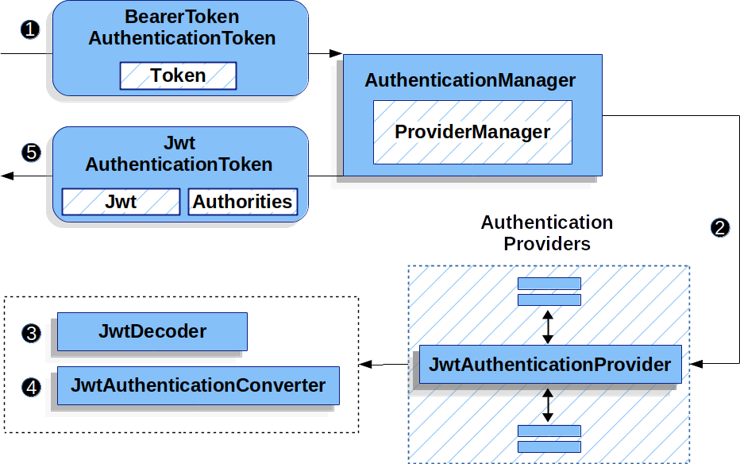

# OAuth 2 Resource Server

리소스 서버는 사용자의 리소스를 보호한다. 클라이언트가 리소스 서버의 엔드포인트를 호출하려면 올바른 토큰이 필요하다.

스프링 시큐리티는 엔드 포인트를 보호하기 위한 2 가지 BearerToken(JWT, OpaqueTokens) 을 제공한다

https://docs.spring.io/spring-security/reference/servlet/oauth2/resource-server/index.html 참고

#### + 인가(Authoriztaion) 와 인증(Authentication) 에 대해서 
```
인가(Authorization)란 인증된 사용자가 요청한 자원에 접근 가능한지를 결정하는 절차이며 인증(Authentication)은 해당 사용자가
본인이 맞는지 확인하는 절차이다.

두 용어가 한글로는 비슷해보이지만 실제 의미는 다르기 때문에 구분할 수 있어야한다. 두 개념의 차이점은 인가를 하는 곳은 권한부여
서버가되고 인증 절차는 리소스서버에서 발생한다는 것이다. (혼동하지 말자!)

출처 https://wildeveloperetrain.tistory.com/50
```
```
* 인가되지 않은 사용자가 리소스를 요청하는 시나리오

1. 인가되지 않은 사용자가 리소스 엔드포인트를 요청한다.
2. 스프링 시큐리티의 FilterSecurityInterceptor 는 인가되지 않은 요청을 거부하고 AccessDeniedException 을 던진다.

3. Since the user is not authenticated, ExceptionTranslationFilter initiates Start Authentication. 
The configured AuthenticationEntryPoint is an instance of BearerTokenAuthenticationEntryPoint,
which sends a WWW-Authenticate header. The RequestCache is typically a NullRequestCache 
that does not save the request, since the client is capable of replaying the requests 
it originally requested.

Tip
AuthenticationEntryPoint is used to send an HTTP response that requests credentials from a client.
https://docs.spring.io/spring-security/reference/servlet/authentication
/architecture.html#servlet-authentication-authenticationentrypoint 참고
```
```
* 인증된 사용자가 리소스를 요청하는 시나리오

1.인증된 클라이언트가 bearer token 을 헤더 값으로 요청하면 BearerTokenAuthenticationFilter 는 
HttpServletRequest 헤더값의 토큰을 추출해서 BearerTokenAuthenticationToken 을 만든다.

2. Next, the HttpServletRequest is passed to the AuthenticationManagerResolver,
which selects the AuthenticationManager. 
The BearerTokenAuthenticationToken is passed into the AuthenticationManager to be authenticated.

3. If authentication fails(매니저에서 인증을 실패한 경우), then Failure

The SecurityContextHolder is cleared out.
The AuthenticationEntryPoint is invoked to trigger the WWW-Authenticate header to be sent again.

The SecurityContextHolder is where Spring Security stores the details of who is authenticated.

4. 인증에 성공하게 되면 인증 정보가 시큐리티 컨텍스트 홀더에 저장되고 BearerTokenAuthenticationFilter 는 
다음 필터를 호출해서 나머지 어플리케이션 로직을 실행한다.


인증 정보는 최종적으로 인메모리 세션 저장소인 SecurityContextHolder에 세션 - 쿠키 방식으로 저장된다.
https://wildeveloperetrain.tistory.com/50 참고 
```
## OAuth 2.0 Resource Server JWT

JWT 를 사용하는 리소스 서버를 만들어보자! 

```
* 의존성 추가

리소스 서버를 만들려면 spring-security-oauth2-resource-server 뿐만 아니라
JWT 토큰을 디코딩하고 확인하기 위한 jose 도 추가해야 한다.

<dependency>
<groupId>org.springframework.security</groupId>
<artifactId>spring-security-oauth2-jose</artifactId>
</dependency>
```

### 인증 서버 설정하기 
```
https://accounts.google.com/.well-known/openid-configuration 구글 검색 문서 URI 
This is a supported endpoint for the authorization server.

spring:
  security:
    oauth2:
      resourceserver:
        jwt:
          issuer-uri: https://accounts.google.com // 토큰 발행자 지정 (인증 서버)
```

### 토큰 인증을 위한 사전 준비 (Start up Expectations)

### Runtime Expectations

이 두 부분은 인증 서버에 요청하기 위한 사전 준비인 것 같은데 모르는 내용이 있어서 일단 스킵.. 

## JWT 인증은 어떻게 동작하는가? 

 

```
1. 앞서 설명했다 시피 인가 필터는 Bearer Token 을 BearerTokenAuthenticationToken 으로 만들어서 
AuthenticationManager(wich is implemented by ProviderManager) 로 전달한다.

2. ProviderManager 는 JwtAuthenticationProvider 로 구성되어 있다 

3. JwtAuthenticationProvider 는 JwtDecoder 를 사용해서 토큰을 검증하고 확인한다.

4. JwtAuthenticationProvider then uses the JwtAuthenticationConverter to convert the Jwt
into a Collection of granted authorities.

5. 인가에 성공하면 BearerTokenAuthenticationToken(Authentication) 을 JwtAuthenticationToken 으로 반환한다.
JwtAuthenticationToken 은 JWT(principal) 와 Authorities 로 구성되어

최종적으로 인증 필터에 의해서 SecurityContextHolder 에 저장되고 HTTP 응답으로 토큰이 반환된다. 395 p

참고로 권한 부여 서버와 리소스 서버는 하나의 애플리케이션으로 구현해도 된다. 396 p
```
## JWK 를 얻을 수 있는 URI 설정하기
```
JWK 란?

It is sometimes useful to be able to reference public key representations, 
for instance, in order to verify the signature on content signed with the corresponding private key. 

The JSON Web Key (JWK) data structure provides a convenient JSON representation for sets of 
public keys utilizing either the Elliptic Curve or RSA families of algorithms.

쉽게 말하자면 인증 서버는 비대칭 쌍 키를 만든다 (키를 만들 때 private, public 두 개를 만듦)

private 키는 서버에서 토큰에 서명할 때 사용하며 외부로 노출하지 않는다.
public 키는 위에서 말한 JWK 를 의미하며 리소스 서버에서 접근해서 토큰의 정보를 확인하는 데만 사용할 수 있다.
(서명은 하지 못함)
```
```
spring:
  security:
    oauth2:
      resourceserver:
        jwt:
          issuer-uri: https://idp.example.com
          jwk-set-uri: https://idp.example.com/.well-known/jwks.json
          
인증 서버가 JWK 를 얻는 엔드포인트를 제공하지 않거나 리소스 서버가 인증 서버로부터 독립적으로
시작한다면 jwk-set-uri 를 설정해야 한다.

그외 특이점
Consequently, Resource Server will not ping the authorization server at startup. 
We still specify the issuer-uri so that Resource Server still validates the iss claim on incoming JWTs.

근데 보통 커스텀 인증 서버를 만들 때 엔드포인트를 제공하기 때문에 ? 직접 주소 값을 지정할 일은 없을듯? 

https://www.baeldung.com/spring-security-oauth-auth-server 
https://www.appsdeveloperblog.com/spring-authorization-server-tutorial/ 예제 참고.
```
## OAuth 2 리소스 서버 커스텀 설정 만들기!

OAuth2ResourceServerConfig 참고

리소스 서버의 커스텀에 관한 내용은 이론적인 부분만으로는 이해가 되지 않기 때문에 리소스 서버의 전체적인 애플리케이션을

구현한 아래의 내용을 우선적으로 참고한다. 
```
키클록을 사용한 권한부여 서버 및 리소스 서버의 구현
https://github.com/eternalrecurrenceofthesame/Spring-security-in-action/tree/main/part4/ch18

마이크로서비스 시큐리티 보안 구현
https://github.com/eternalrecurrenceofthesame/Spring-MSA/tree/main/part02/ch11
```
```
* Custom JWT Configuration

@Bean
public SecurityFilterChain filterChain(HttpSecurity http) throws Exception {
http
  .authorizeHttpRequests(authorize -> authorize
   .requestMatchers("/messages/**").hasAuthority("SCOPE_message:read") // 인증 서버의 사용자 범위 설정
   .anyRequest().authenticated())
   .oauth2ResourceServer(oauth2 -> oauth2
                .jwt(jwt -> jwt.jwtAuthenticationConverter(myConverter())));
return http.build();

message:read 스코프를 가진 클라이언트만 엔드 포인트에 접근할 수 있고 컨버터를 따로 설정했다.
```
```
* jwtDecoder 설정 기본 방법들 

리소스에서 토큰을 디코딩 할 때 사용되는 jwk 키 값은 앞서 설명했듯이 yml 로 설정하면 된다.
spring.security.oauth2.resourceserver.jwt.jwk-set-uri // 이 값이 설정 값으로 사용됨


자바 설정을 사용하는 경우 직접 빈으로 디코더를 만들거나 필터 체인에 넣을 수 있다. 

@Bean
public JwtDecoder jwtDecoder() {
    return JwtDecoders.fromIssuerLocation(issuerUri); // @Value 로 yml 에서 주소 받아오기 
}

@Bean
public SecurityFilterChain filterChain(HttpSecurity http) throws Exception {
http
 .authorizeHttpRequests(authorize -> authorize
 .anyRequest().authenticated())
 .oauth2ResourceServer(oauth2 -> oauth2
 .jwt(jwt -> jwt
 .jwkSetUri("https://idp.example.com/.well-known/jwks.json")));

return http.build();}
```
### CustomDecoder 만들어서 자바 설정으로 등록하기 
```
* 커스텀 디코더 양식

@Bean
public SecurityFilterChain filterChain(HttpSecurity http) throws Exception {
 http
 .authorizeHttpRequests(authorize -> authorize
  .anyRequest().authenticated())
  .oauth2ResourceServer(oauth2 -> oauth2
    .jwt(jwt -> jwt
     .decoder(myCustomDecoder()))); 
       
     return http.build();

위 예시처럼 직접 만든 디코더를 주입해주거나 
     
@Bean
public JwtDecoder jwtDecoder() {
    return NimbusJwtDecoder.withJwkSetUri(jwkSetUri).build(); // 커스텀은 Nimbus 를 사용한다 ? 
}

JwtDecoder 를 빈으로 등록해서 사용할 수 있다.// Or, exposing a JwtDecoder @Bean has the same effect as decoder()


커스텀 디코더를 직접 만들면 validation, mapping, or request timeouts 같은 설정을 할 수 있다.
This is handy when deeper configuration, like validation, mapping, or request timeouts, is necessary.
```
### 디코더 알고리즘 설정하기
```
NimbusJwtDecoder 는 디코딩 알고리즘으로 RS 256 을 기본 값으로 사용하지만 다른 값을 사용할 수 있음

yml 설정
spring:
  security:
    oauth2:
      resourceserver:
        jwt:
          jws-algorithm: RS512  // RS512 로 변경 
          jwk-set-uri: https://idp.example.org/.well-known/jwks.json

자바 빈 설정 
@Bean
JwtDecoder jwtDecoder() {
    return NimbusJwtDecoder.withJwkSetUri(this.jwkSetUri)
            .jwsAlgorithm(RS512).jwsAlgorithm(ES512).build();
} 

@Bean
JwtDecoder jwtDecoder() {
    return NimbusJwtDecoder.withJwkSetUri(this.jwkSetUri)
            .jwsAlgorithms(algorithms -> {
                    algorithms.add(RS512);
                    algorithms.add(ES512);
            }).build();}  // 디코더 알고리즘은 여러 개 사용 가능
            

JWSKeySelector 를 사용하면 퍼블릭 키 엔드 포인트 정보를 이용해서 자동으로 디코딩 알고리즘을 설정해준다!
@Bean
public JwtDecoder jwtDecoder() {
    JWSKeySelector<SecurityContext> jwsKeySelector =
            JWSAlgorithmFamilyJWSKeySelector.fromJWKSetURL(this.jwkSetUrl);

    DefaultJWTProcessor<SecurityContext> jwtProcessor =
            new DefaultJWTProcessor<>();
    jwtProcessor.setJWSKeySelector(jwsKeySelector);

    return new NimbusJwtDecoder(jwtProcessor);
}
```
## 비대칭 공개 키를 직접 받아서 사용하기

디코더를 만들어서 사용할 수도 있지만 인증 서버로부터 퍼블릭 키를 직접 받아 올 수도 있다.

```
* xml 설정

spring:
  security:
    oauth2:
      resourceserver:
        jwt:
          public-key-location: classpath:my-key.pub
```
```
* 자바 설정

@Bean
BeanFactoryPostProcessor conversionServiceCustomizer() {
    return beanFactory ->
        beanFactory.getBean(RsaKeyConversionServicePostProcessor.class)
                .setResourceLoader(new CustomResourceLoader());
}

key.location: hfds://my-key.pub // yml

@Value("${key.location}")
RSAPublicKey key;   // autowire 해서 사용한다. 

+ 빌더를 사용해서 직접 디코더 만들기

@Bean
public JwtDecoder jwtDecoder(){
return NimbusJwtDecoder.withPublicKey(this.key).build();}

근데 이렇게 까지 직접 키를 받을 거 같진 않고 개인적인 생각이지만 자동 알고리즘 디코딩을 사용할듯? 

++ 번외로 직접 시크릿 키를 가져오는 방법!
@Bean
public JwtDecoder jwtDecoder() {
    return NimbusJwtDecoder.withSecretKey(this.key).build();}
```
## 리소스 서버 인증 권한(클라이언트 스코프) 를 설정하는 방법 
```
JWT 스코프로 리소스 엔드포인트 권한을 부여하려면 접두사를 붙여줘야 한다.

http
.authorizeHttpRequests(authorize -> authorize
.requestMatchers("/contacts/**").hasAuthority("SCOPE_contacts")
            
인증 서버에서 contacts 를 사용자 정보 scope 로 넘겨주면 인증할 때는 접두사 SCOPE_ 를 붙여야 한다
```
### JwtAuthenticationToken 의 Authorities 정보 커스텀하기
```
앞서 설명했다시피 JwtAuthenticationToken 은 JWT(principal) 와 Authorities 로 구성되고 
시큐리티 컨텍스트 홀더에 저장됨 여기서는 JwtAuthenticationToken 으로 변환되서 컨텍스트에 저장되기 전에

Token 의 Authorities 값을 사용자 커스텀으로 만들어 보겠음. (JWTClaimsSet 참고)

* 간단하게 오토리티 클레임 이름을 수정하는 방법

@Bean
public JwtAuthenticationConverter jwtAuthenticationConverter() {
    JwtGrantedAuthoritiesConverter grantedAuthoritiesConverter = new JwtGrantedAuthoritiesConverter();
    grantedAuthoritiesConverter.setAuthoritiesClaimName("authorities");

    JwtAuthenticationConverter jwtAuthenticationConverter = new JwtAuthenticationConverter();
    jwtAuthenticationConverter.setJwtGrantedAuthoritiesConverter(grantedAuthoritiesConverter);
    return jwtAuthenticationConverter;
}

* Authorities Prefix 수정하기 (SCOPE_ 접두사를 ROLE_ 접두사로 변경)
@Bean
public JwtAuthenticationConverter jwtAuthenticationConverter(){
JwtGrantedAuthoritiesConverter grantedAuthoritiesConverter = new JwtGrantedAuthoritiesConverter();
grantedAuthoritiesConverter.setAuthoritiyPrefix("ROLE_");

JwtAuthenticationConverter jwtAuthenticationConverter = new JwtAuthenticationConverter();
jwtAuthenticationConverter.setJwtGrantedAuthoritiesConverter(grantedAuthoritiesConverter);

return jwtAuthenticationConverter;}

https://docs.spring.io/spring-security/reference/servlet/oauth2/resource-server/
jwt.html#oauth2resourceserver-jwt-authorization-extraction 

그외 CustomAuthenticationConverter 만들기 참고 
```

## Configuring Validation 토큰 구성 검증하기 

#### + 간단한 용어 정리 
```
payload: 토큰에 담을 전체적인 정보가 들어있다.
claim: 정보의 한 조각을 의미하며 name/value 의 쌍으로 이루어진다.

클레임은 등록된(registered) 클레임, 공개(public) 클레임, 비공개(private) 클레임으로 나뉜다.

1. 등록된 클레임

iss: 토큰 발급자 (issuer)
sub: 토큰 제목 (subject)
aud: 토큰 대상자 (audience)
exp: 토큰의 만료시간 (expiraton), 시간은 NumericDate 형식으로 언제나 현재 시간보다 이후로
설정되어 있어야 한다.

nbf: 토큰 활성 날짜, NumbericDate 형식이며 이 날짜가 지나기 전까지 토큰이 처리되지 않는다.
iat: 토큰 발급 시간(issued at) 토큰의 age 를 판단할 수 있다.
jti: JWT 고유 식별자 중복 처리 방지 

2. 공개 클레임

공개 클레임은 충돌이 방지된 이름을 가지며 클레임 이름을 uri 형식으로 만든다.

3. 비공개 클레임

등록도 아닌 공개도 아닌 클레임으로 보통 클라이언트와 서버 협의하에 사용되는 클레임 이름.
이름이 중복되어 충돌되는 경우를 유의해야 한다.

https://velopert.com/2389 참고
```
### Customizing Timestamp Validation
```
토큰을 발행하면 토큰은 유효 기간(nbf, exp) 을 가지게됨 문제는 토큰을 발행하는 서버의 시간과
토큰을 사용하는 사용자 클라이언트의 시간이 다를 수 있고 서버에서는 토큰이 만료되었지만 클라이언트에서는 

만료되지않는 또는 반대의 상황이 발생할 수 있고 이런 문제는 서버에 부담을 줄 수 있다. 

리소스 서버는 JwtTimestampValidator 를 사용해서 토큰 유효 기간을 확인할 수 있고 앞서 설명한 문제점을 
완화 시킬 수 있음.

Resource Server uses JwtTimestampValidator to verify a token’s validity window, and it can 
be configured with a clockSkew to alleviate the above problem

@Bean
    JwtDecoder jwtDecoder(){
        NimbusJwtDecoder jwtDecoder = (NimbusJwtDecoder) JwtDecoders.fromIssuerLocation(issuerUri);

        DelegatingOAuth2TokenValidator<Jwt> withClockSkew = new DelegatingOAuth2TokenValidator<>(
                new JwtTimestampValidator(Duration.ofSeconds(60)), // 디폴트 값이 60
                new JwtIssuerValidator(issuerUri));

        jwtDecoder.setJwtValidator(withClockSkew);

        return jwtDecoder;}
        
        오차 범위를 60 초 이내로 줄인다는 말인듯? 
```
### Configuring a Custom Validator
```
* aud(발행자) 를 검증하는 간단한 로직을 만들어 보겟음.

간단하게 메서드로 만들기

OAuth2TokenValidator<Jwt> audienceValidator() {
    return new JwtClaimValidator<List<String>>(AUD, aud -> aud.contains("messaging"));
}

* 클래스로 만들어서 디코더에 주입하기

static class AudienceValidator implements OAuth2TokenValidator<Jwt> {
    OAuth2Error error = new OAuth2Error("custom_code", "Custom error message", null);

    @Override
    public OAuth2TokenValidatorResult validate(Jwt jwt) {
        if (jwt.getAudience().contains("messaging")) {
            return OAuth2TokenValidatorResult.success();
        } else {
            return OAuth2TokenValidatorResult.failure(error);
        }
    }
}

// ...

OAuth2TokenValidator<Jwt> audienceValidator() {
    return new AudienceValidator();
}

// 디코더 
@Bean
JwtDecoder jwtDecoder() {
    NimbusJwtDecoder jwtDecoder = (NimbusJwtDecoder)
        JwtDecoders.fromIssuerLocation(issuerUri);

    OAuth2TokenValidator<Jwt> audienceValidator = audienceValidator();
    OAuth2TokenValidator<Jwt> withIssuer = JwtValidators.createDefaultWithIssuer(issuerUri);
    OAuth2TokenValidator<Jwt> withAudience = new DelegatingOAuth2TokenValidator<>(withIssuer, audienceValidator);

    jwtDecoder.setJwtValidator(withAudience);

    return jwtDecoder;
}
```
